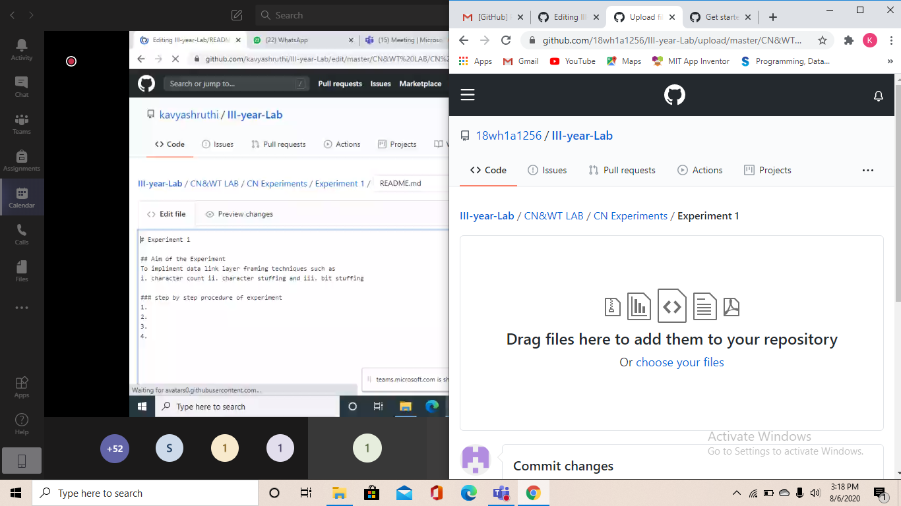

# Experiment 1

## Aim of the Experiment
To implement data link layer framing techniques such as 
1. character count 2. character stuffing and 3. bit stuffing

### step by step procedure of experiment
1.
2.
3.
4.

### Output

